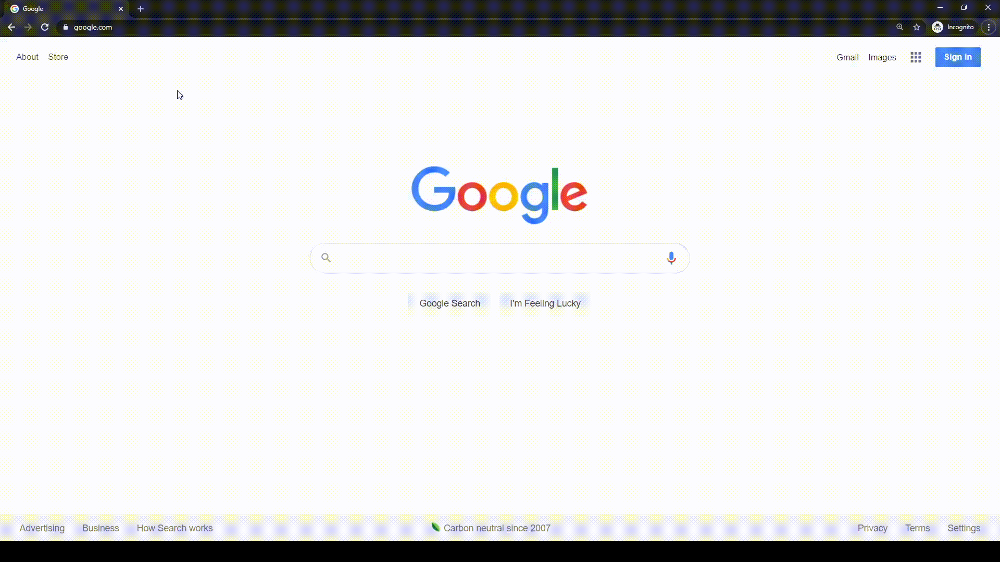

Top Track is a web-based Python application where a user can search for any artist, and the top track of that artist will be displayed.

---

## How to use Top Track

Simply navigate to http://toptrack2020.herokuapp.com/ and search for any artist in the search bar. It's that easy!

---

## How Top Track works

Top Track is a Django (3.1.4) application written in Python (3.9.0). It uses Spotipy (2.16.1) to access Spotify's API 
and return the most popular song/track for any given artist.

---

## Noteable Application Features
* Concise and organized OOP style to keep code readable and malleable 
* Use of Git for version control and added security
* Use of secret management to set environment variables of Client ID, Client Secret, and Secret Key to keep the application safe and reliable
* Added testing suite to make sure application runs smoothly without errors
* Included requirements.txt file for easy installation
* Exceptionally strong README.md

---

## Steps to Run Top Track Locally

* Python version 3.9.0 or greater is required
* Download the project from GitHub
* Get a Client ID and Client Secret from Spotify. To do this:
  * Navigate to https://developer.spotify.com/ and click on the Dashboard tab
  * Create a new Spotify account or log in to an existing Spotify account
  * Create a new app in order to receive a Client ID and Client Secret in order to access Spotify's API
  * Set environment variables of SPOTIPY_CLIENT_ID and SPOTIPY_CLIENT_SECRET or simply replace all instances 
    of those variables in the code with the CLIENT_ID and CLIENT_SECRET given by Spotify. 
    (You can find these variables in settings.py and views.py)
* Navigate to the projects root directory in your command line
* Make sure that a virtual environment is active
* On the Command line, in the project's root directory, type `pip install -r requirements.txt` to automatically install project dependencies
* Still in the root directory, type `python manage.py runserver` to run the server locally
* Click on the hyperlink to open the website or simply navigate to localhost:8000 in your browser to get started!

